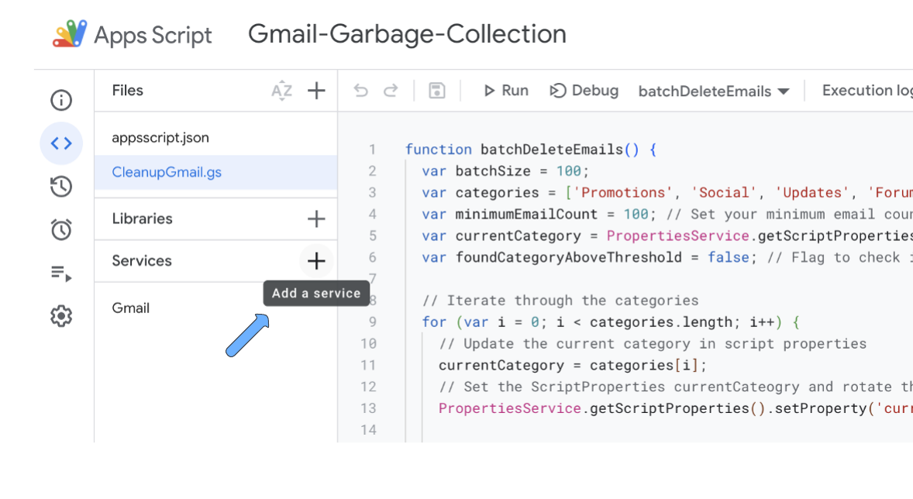
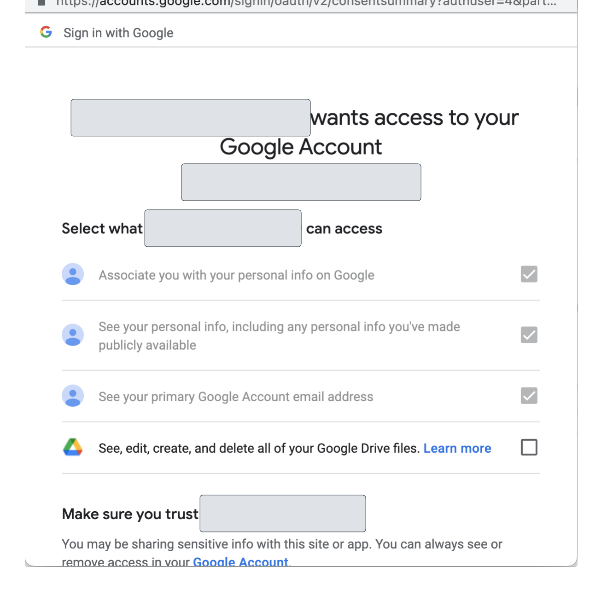
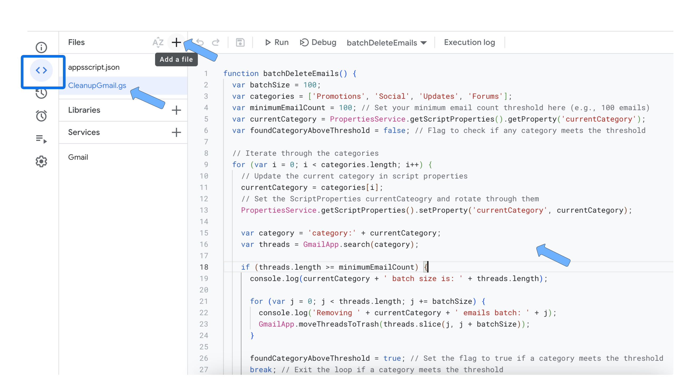
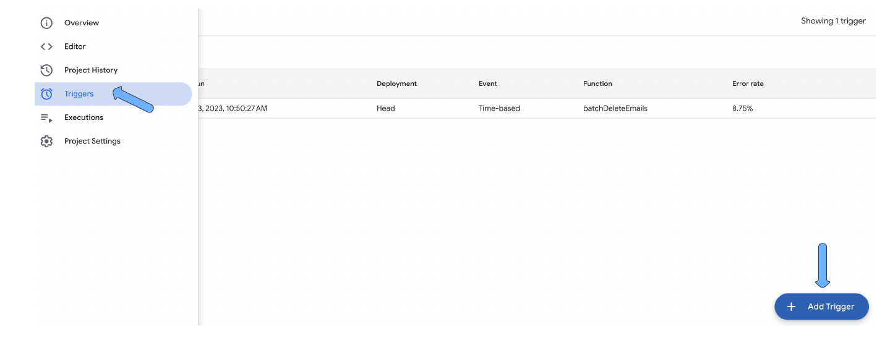
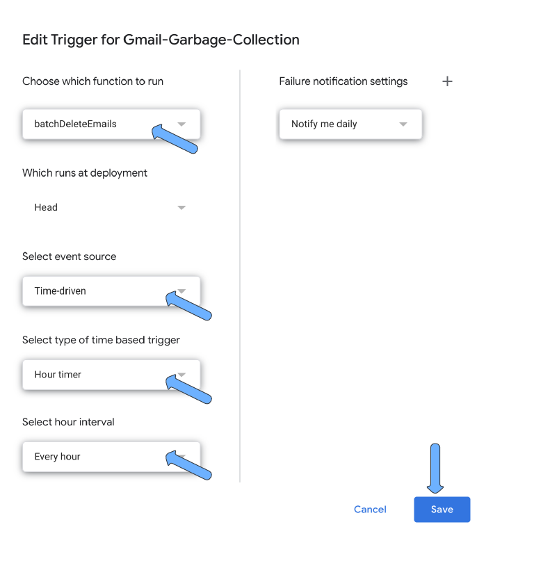

# Gmail Cleaner

Cleanup your personal Gmail using a [Google App Scripts](https://script.google.com).


## About

This AppScript will leave you with no more than 100 Social, Updates, Promotions, and Forums emails.

If you have a lot of email subscriptions and other updates and you are not periodically
unsubscribing, deleting, or filtering, then you probably have good amount of junk mail.

You may even have to pay to [add storage](https://support.google.com/drive/answer/2375123?hl=en&co=GENIE.Platform%3DDesktop).

## Step-by-step Guide

### Step 1 - Get started

Sign up for [Google App Scripts](https://script.google.com/) workspace.


Click on New Project once you are signed in.

### Step 2 - Project Settings

#### Project Setting 1

Enable Gmail services for the AppScript.

 

#### Project Setting 2

Copy in ```appscript.json``` to set the OAuth scope.  See the last image in this step
2 section for which buttons to click.

The Apps Script editor hides manifest files by default in order to protect your 
Apps Script project settings. Follow these steps to make a hidden project manifest 
visible in the Apps Script editor:

- Open the script project in the Apps Script editor.
- Click Project Settings
- Select the ```Show appsscript.json``` manifest file in editor checkbox.

Configure ```appscript.json``` next.


You will be prompted to connect your personal account so that the script
can run using your gmail credentials.



Go ahead and re-hide the ```appscript.json```

#### Project Setting 3

Edit the script properties and add the ```currentCategory``` property.


### Step 3 - Add the script

Now that the project settings are in place add the script. Enter into editor mode and 
copy in ```CleanupGmail.gs```.



### Step 4 -Setup the schedule

Add a new Trigger and select ```batchDeleteEmail``` to run on an hourly timer.





Important: The Max batchSize is 100.  Anything larger will cause the script to fail within a 24hour window.

```var batchSize = 100```

### Step 5 - Monitor and periodically check

Watch it run and periodically check it.  Navigate over to executions to see the execution log.


If all categories are below the 100 email threshold then stop processing.


### Constraints

The maximum batchSize is 100.  ```var batchSize = 100```

The main constraint is the number of times you can call ```batchDeleteEmail``` in a 24 hour period.

Google has [quotas](https://stackoverflow.com/questions/10619919/service-invoked-too-many-times-for-one-day-gmail-read).

See more about official quotas [here.](https://developers.google.com/apps-script/guides/services/quotas)

